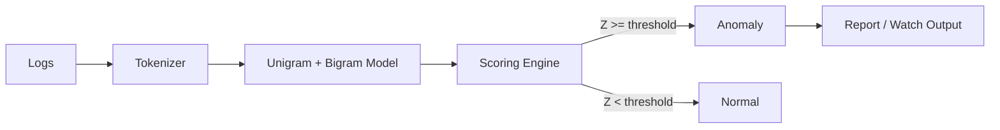

# Sentinel — Bash Log Anomaly Detector

AI-style anomaly detection for logs using a lightweight n-gram (unigram + bigram) language model.
100% Bash + awk + coreutils. No Python, no dependencies, no network calls.

---

## 🚀 Features
- Train on “normal” logs; score new events against the baseline
- Robust anomaly detection using median/MAD Z-scores
- Real-time watch mode for streaming logs
- Explain mode for per-token/bigram contributions
- Outputs anomalies to CLI or HTML reports

---

## 📦 Installation

Clone the repository:

```bash
git clone https://github.com/<your-user>/sentinel.git
cd sentinel
chmod +x sentinel.sh
````

Optional: install globally so you can just run `sentinel`:

```bash
sudo ./scripts/install.sh
```

---

## ⚡ Quick Start

1. **Train a model** on your “normal” syslog:

```bash
./sentinel.sh train --model ./model --input /var/log/syslog
```

2. **Score your auth logs** and produce an HTML anomaly report:

```bash
./sentinel.sh score --model ./model --input /var/log/auth.log --out ./auth_report.html
```

3. **Monitor logs in real time**:

```bash
sudo ./sentinel.sh watch --model ./model --input /var/log/auth.log --threshold 3.0
```

4. **Explain why a line was flagged**:

```bash
./sentinel.sh explain --model ./model --line "Failed password for root from 203.0.113.55 port 52012 ssh2"
```

---

## 📂 Model Directory

When you run `train`, Sentinel creates these files inside `model/`:

* `unigram.tsv` — token frequency table
* `bigram.tsv` — bigram frequency table
* `stats.tsv` — robust statistics (median, MAD, etc.)

⚠️ These files are generated from your logs and should **not** be committed to Git.
The repo includes an empty `model/` folder with `.gitkeep` and a `README.md` so the structure is clear.

---

## 🔧 Command Reference

### Train

```bash
sentinel.sh train --model DIR --input FILE [--min-count N]
```

### Score

```bash
sentinel.sh score --model DIR --input FILE [--out REPORT.html] [--threshold Z] [--top K]
```

### Watch

```bash
sentinel.sh watch --model DIR --input FILE [--threshold Z]
```

### Explain

```bash
sentinel.sh explain --model DIR [--line "text"]  # or stdin
```

---

## 🛡️ How It Works

* **Tokenizer**: lowercases input and splits on non-alphanumeric characters.
* **Model**: counts unigrams and bigrams, applies add-1 smoothing.
* **Scoring**: computes negative log-likelihood; anomalies flagged via robust Z-scores (median & MAD).
* **Outputs**: anomalies to CLI, HTML report, or live alerts in watch mode.



---

## 🧭 Best Practices

* Train only on **clean baseline logs** to avoid poisoning the model.
* Use separate models for different sources (auth, syslog, web).
* Retrain periodically to adapt to log drift.
* Pipe `watch` output into `logger` or your SIEM for centralized alerting:

```bash
./sentinel.sh watch --model ./model --input /var/log/auth.log \
  | logger -t sentinel -p user.warning
```

---

## 🤝 Contributing

Pull requests are welcome! Please run:

```bash
make fmt lint test
```

Before submitting a PR, see `.github/` for issue & PR templates.

---

## 📜 License

MIT — see [LICENSE](LICENSE).

```
